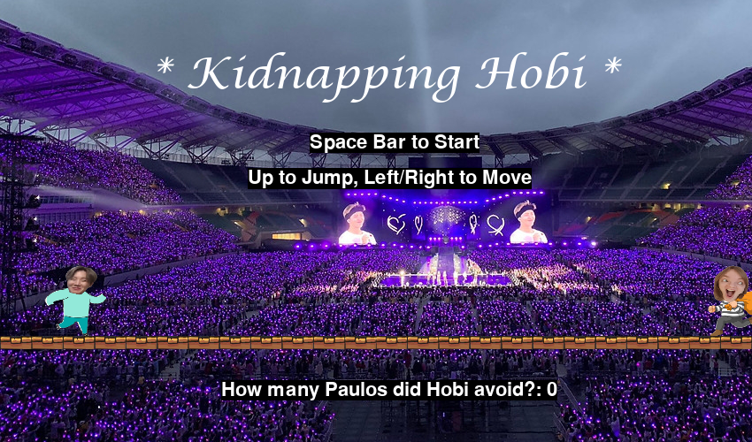
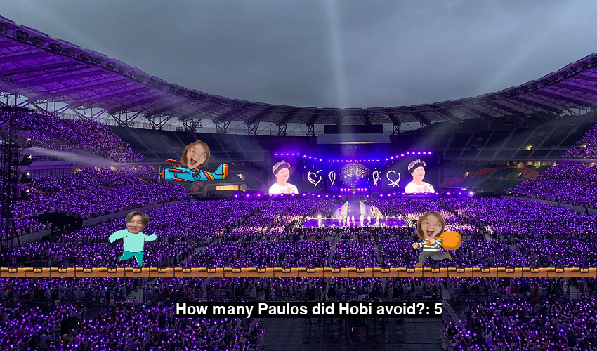

# 👾 Infinite-Runner-Game: **Kidnapping Hobi**

      
    

## 👉 **Introduction**
Hi guys! 🙋‍♀️  
In this first GitHub repository I'm sharing the code of a game I developed using python's library `pygame`.

Hobi (J-Hope from BTS) belongs to a group that I really like, so for fun I developed an infinite-runner game where the main character, Hobi, has to try not to get caught by different versions of me (*walking*-me, *airplane*-me) attempting to catch him. All of this to the tune of "Boy With Luv" by BTS feat. Halsey. The musical adaptation for the game was taken from the YouTube channel *Darnu-Pop* (https://www.youtube.com/watch?v=BjmyjY1k364).

***Disclaimer.** It's just a game, don't take it too seriously.*

## ⚠️ **Requirements**

To play the game you need to have python 3 (it doesn't work on python 2) and you need to install the library `pygame` (`pip install pygame`).

## ✨ **How to play**
Download the repository and run the main `pau_game.py`. 
Have fun and try to get the highest score! 

*If it does not start immediately, press space bar a few times.*

## 🔜 **Future developments**
The game is part of an ongoing reinforcement learning project, which aims to create an AI capable of autonomous play. 